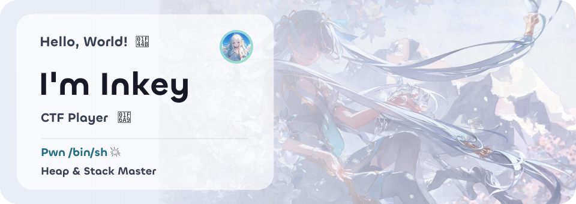
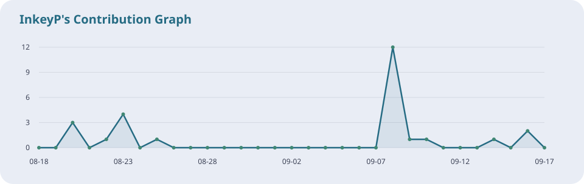

  <a href="https://git.io/typing-svg">
    <picture>
      <source media="(prefers-color-scheme: dark)" srcset="./assets/profile-dark.svg" />
      <source media="(prefers-color-scheme: light)" srcset="./assets/profile-light.svg" />
      
    </picture>
  </a>

   
   

  

   
   

  

    🚩 <b>CTF Player</b> focusing on <b>PWN</b> &amp; <b>Penetration</b> 
    🐛 Hunting bugs in the heap and stack | 🐚 Seeking for <code>system("/bin/sh")</code>
  

   

  <picture>
    <source media="(prefers-color-scheme: dark)" srcset="./assets/cards/stats-dark.svg" />
    
  </picture>
  <picture>
    <source media="(prefers-color-scheme: dark)" srcset="./assets/cards/languages-dark.svg" />
    
  </picture>

   
   

  <!-- 贪吃蛇吃 Commit 动图 -->
  <picture>
    <source media="(prefers-color-scheme: dark)" srcset="https://raw.githubusercontent.com/InkeyP/InkeyP/output/github-contribution-grid-snake-dark.svg" />
    
  </picture>

   
   

  <picture>
    <source media="(prefers-color-scheme: dark)" srcset="./assets/cards/activity-dark.svg" />
    
  </picture>

   
   

  <h3>🛠️ Tech Stack</h3>
  
  
  
  
  

   
   

  

